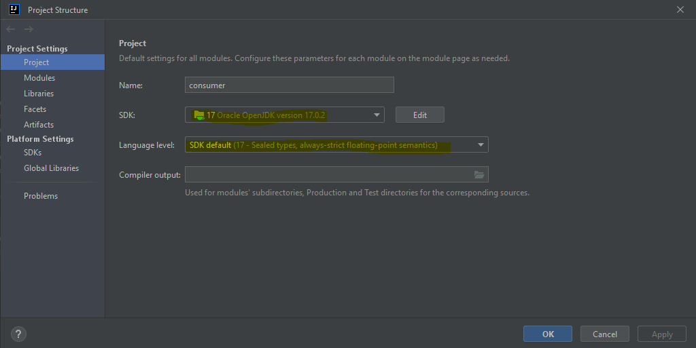

# CONSUMER

---

## OVERVIEW

---

### GRUPO

- RM346315: Lais Kagawa
- RM346511: Jônatha Lacerda Gonzaga
- RM346958: Thiago de Souza Zanella
- <del> RM347277: Gustavo de Oliveira Freitas</del> (Desistiu do curso)

---

### REPOSITÓRIOS RELACIONADOS

- https://github.com/lakagawa/drone
- https://github.com/zanella86/producer

---

### FERRAMENTAS DE INTEGRAÇÃO

- Slack
- Github
- Trello
- RabbitMQ
- Draw.io

---

## PARA TESTAR

### Configure o ambiente

#### Versão do java

#### Execução com o spring boot/maven

#### RabbitMQ 

Verifique os procedimentos descritos em "RabbitMQ" no repositório [producer](https://github.com/zanella86/producer).

##### Configure o endereço do broker

No arquivo [application.yml](src/main/resources/application.yml) preencha o valor do atributo 
`spring.rabbitmq.addresses`

#### Execute o teste!

Verifique os procedimentos descritos em "Execute o teste!" no repositório [producer](https://github.com/zanella86/producer).

---

### Resultado esperado

#### Relatório de alertas

--- 

#### REFERÊNCIAS

- [CloudAMQP - RabbitMQ](https://customer.cloudamqp.com/instance/)
- [Draw.io](https://app.diagrams.net)
